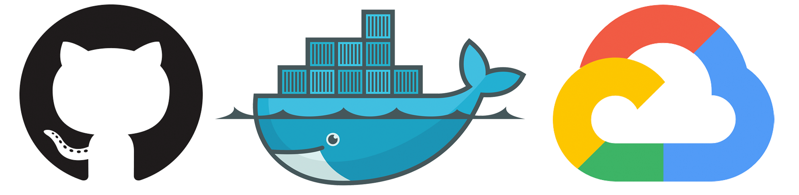

# Creating a CI/CD Environment for Serverless Containers on Google Cloud Run



This repository is a complement to my medium article. If you wanna follow step by step, check [my writing]().

## 2022/04/25 RJP entered this comment to test the push of code to this repository
##  Update again to trigger build

## Architecture

This is how our infrastructure works:

## Golang

Running:

```bash
$ go run server.go
```

Running tests:

```bash
$ go test -v
```

Running Dockerfile:

```bash
$ docker build . -t example

$ docker run -p 8000:8000 --env PORT=8000 example
```
